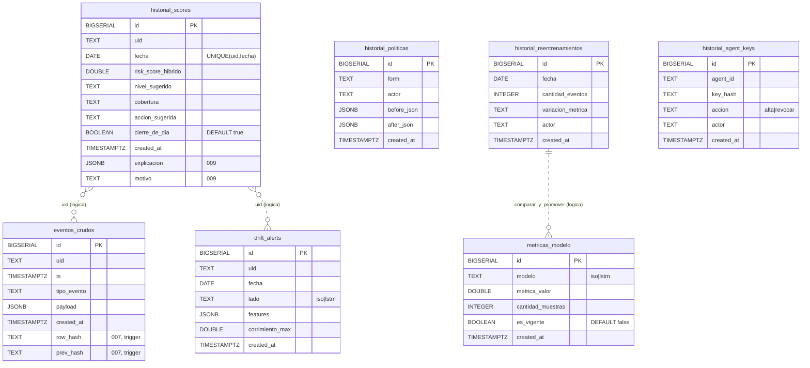
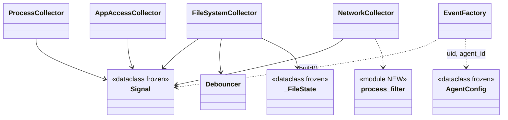
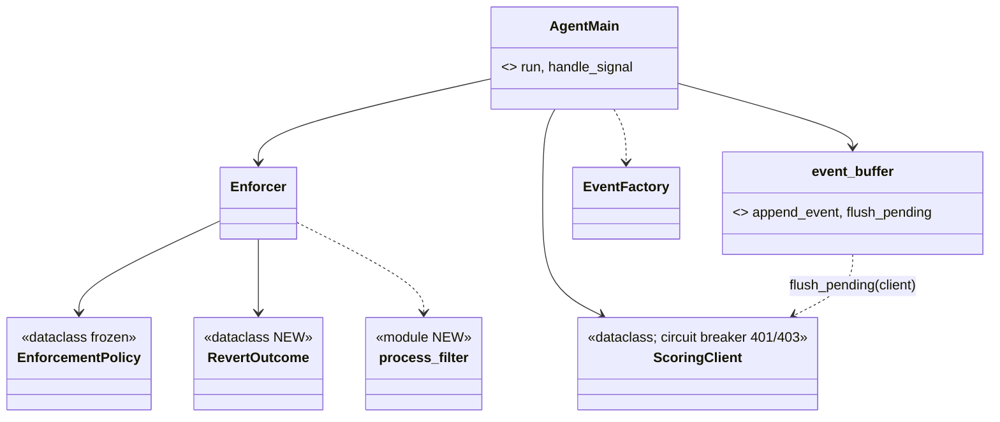
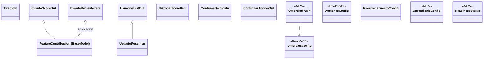
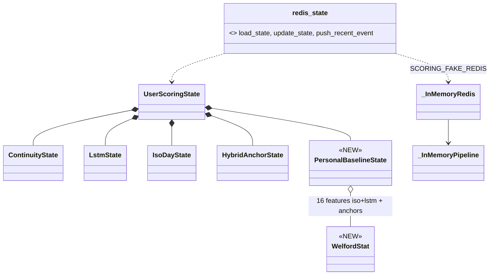
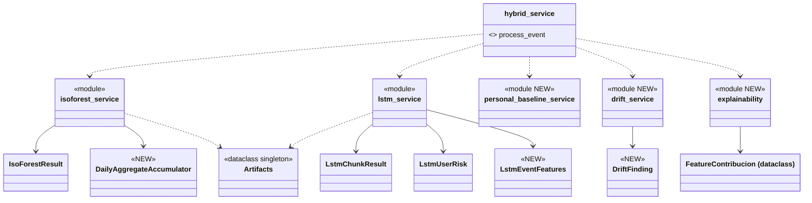
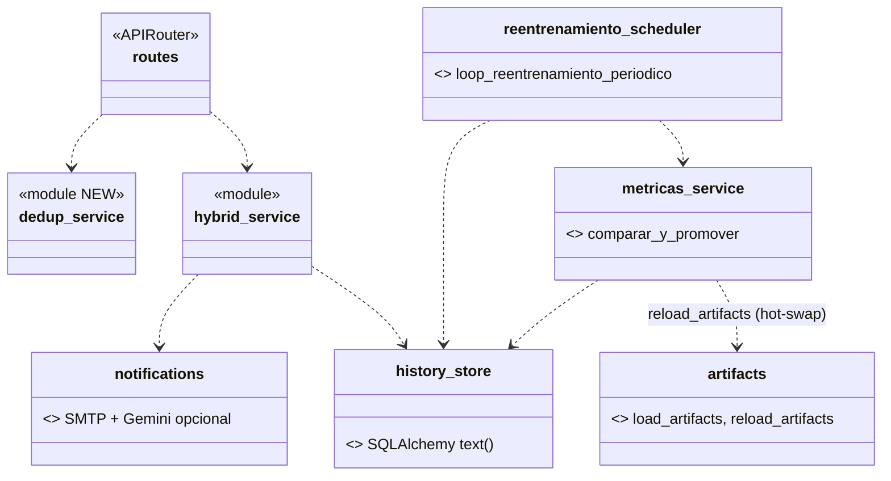
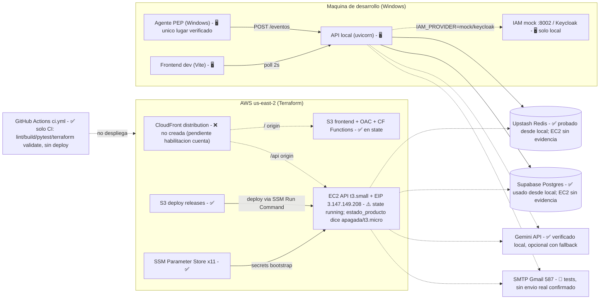

# Modelo de datos y diagramas — PFI (corte 75 %)

Rama `analysis/modelo-datos-pfi75`. Generado por lectura de código/SQL/Terraform; no se tocó Redis, Postgres ni AWS.

Marcas: **[V]** verificado leyendo código/archivos · **[I]** inferido (no ejecutado ni confirmado contra el sistema real).

---

## 1. Postgres / Supabase

Fuente **[V]**: `api/app/scoring/sql/001`–`009`. Se aplican a mano (SQL editor de Supabase o `psql -f`); no hay runner, Alembic ni `supabase/migrations`. No hay ORM: SQL crudo con SQLAlchemy `text()` en `api/app/scoring/history_store.py` (`get_engine` L46-58). `historial_agent_keys` la escribe solo `scripts/manage_agent_key.py` (engine propio).

**Sin FKs entre tablas [V]**. Las relaciones por `uid` / `agent_id` son lógicas (líneas punteadas = **[I]**, derivadas de nombres de columna).



### Migraciones en orden **[V]**

| # | Archivo | Efecto |
|---|---|---|
| 001 | `001_create_historial_scores.sql` L11-24 | Crea `historial_scores`; `UNIQUE(uid,fecha)`; índice `idx_historial_scores_uid_timestamp (uid, fecha DESC)`. **Sin RLS**. |
| 002 | `002_create_historial_politicas.sql` L11-29 | Crea tabla; índice `created_at DESC`; RLS on, sin policies. |
| 003 | `003_create_historial_reentrenamientos.sql` L15-32 | Crea tabla; índice `created_at DESC`; RLS on. |
| 004 | `004_create_drift_alerts.sql` L15-36 | Crea tabla; índices `created_at`, `uid`; RLS on. |
| 005 | `005_create_eventos_crudos.sql` L30-46 | Crea tabla; índices `uid`, `created_at`; RLS on. |
| 006 | `006_create_metricas_modelo.sql` L21-41 | Crea tabla; índices `created_at`, `(modelo, es_vigente)`; RLS on. "Un vigente por modelo" lo garantiza la app, no un constraint. |
| 007 | `007_add_hash_chain_eventos_crudos.sql` L70-123 | `CREATE EXTENSION pgcrypto`; agrega `row_hash`, `prev_hash` (nullable); índice `(uid, id)`; función `eventos_crudos_hash_chain()` + trigger `trg_eventos_crudos_hash_chain` BEFORE INSERT FOR EACH ROW. |
| 008 | `008_create_historial_agent_keys.sql` L15-35 | Crea tabla; índices `created_at`, `agent_id`; RLS on. |
| 009 | `009_add_explicacion_historial_scores.sql` L12-13 | `ALTER historial_scores ADD explicacion JSONB, motivo TEXT`. |

### Hash chain (007) **[V]**
- Cadena **por uid**, no global. Dentro del trigger: `pg_advisory_xact_lock(hashtext(uid))` (L88), lee último `row_hash` del uid (L90-94), génesis `repeat('0',64)` (L97).
- `row_hash = sha256(concat_ws('|', id, created_at, uid, ts, tipo_evento, payload::text, prev_hash))` (L105-112).
- El INSERT de `write_evento_crudo` (`history_store.py:403`) no menciona `row_hash`/`prev_hash`: los llena el trigger.
- Verificación/backfill fuera de la API: `scripts/verify_hash_chain.py`, `scripts/backfill_hash_chain.py`.

### Observaciones **[V]**
- 7 tablas distintas. Ningún `CHECK`: los enums (`form`, `lado`, `accion`, `modelo`) están solo en comentarios.
- `historial_scores` es la única sin RLS; `eventos_crudos` la única con trigger/función.
- Funciones por tabla en `history_store.py`: `historial_scores` (L61 write_closed_day, L111, L128, L143), `historial_politicas` (L177, L209), `historial_reentrenamientos` (L230, L277, L358), `drift_alerts` (L300, L337), `eventos_crudos` (L388, L403), `metricas_modelo` (L428, L462, L480).

---

## 2. Redis

Fuente **[V]**: `redis_state.py` (prefijos L283-330), `config_store.py`, `dedup_service.py`, `iam_service.py`, `iam_providers.py`, `auth.py`, `scripts/manage_agent_key.py`. Todas las claves cuelgan de `scoring:`. **Ninguna usa TTL nativo** (cero `expire`/`setex`/`ex=` en `api/app`): el vencimiento se guarda como epoch dentro del valor y se chequea al leer, porque `_InMemoryRedis` no soporta `expire`.

| Clave | Def. | Tipo | Contenido | TTL | Escribe | Lee |
|---|---|---|---|---|---|---|
| `scoring:{uid}` | `redis_state.py:276-277` | STRING (JSON) | `asdict(UserScoringState)` (L225-263): continuity, lstm, iso_day, hybrid_anchor, personal_baseline, total_events, last_* (score, nivel, cobertura, accion, explicacion, motivo, role, department, confirmacion_*) | sin TTL | `update_state` (L477-512, WATCH/MULTI/EXEC, 20 reintentos) vía `hybrid_service.py:427,470`; `save_state` L412; `routes.py:279`; borra `reset_state` L416 (`routes.py:287,305`) | `load_state` L408 (`routes.py:203,303,380`); `list_uids` (SCAN) |
| `scoring:{uid}:eventos` | `redis_state.py:420-421` | LIST (JSON) | `{timestamp,tipo,risk_score_hibrido,nivel_sugerido,accion_id,detalle,explicacion}` | sin TTL; `LTRIM` a `config:eventos_recientes` (def. 30) | `push_recent_event` L424-444 (`hybrid_service.py:429`); `delete_recent_events` L453 | `list_recent_events` L447 (`routes.py:338`, `notifications.py:316`) |
| `scoring:{uid}:notif_cooldown` | `redis_state.py:296,457-458` | STRING | epoch float de vencimiento | vence a 600 s (`notifications.py:45`), chequeo al leer | `marcar_notif_cooldown` L469 (`notifications.py:359`); delete en `routes.py:288,307` | `notif_cooldown_activo` L461 |
| `scoring:dedup:{sha256}` | `dedup_service.py:31-32`; prefijo `redis_state.py:304` | STRING | `{expires_at, response: EventoScoreOut}`; hash sobre `uid,time,type,params,location,role,isLocalIP` (L28,35) | 6 h (`DEDUP_TTL_SECONDS` L26), al leer; **las vencidas nunca se borran** | `store_response` L50 (`routes.py:197`) | `get_cached_response` L40 (`routes.py:188`) |
| `scoring:agent_key:{sha256(key)}` | `redis_state.py:313`; `auth.py:84`; `manage_agent_key.py:45` | STRING | `{agent_id, enabled, created_at, label}`; key en claro no se guarda | sin TTL (revocación explícita) | `manage_agent_key.py:87` (alta), `:117` (revocar) | `auth._agent_key_lookup` L79-85; `agent_key_configurada` L74 (SCAN early-exit) |
| `scoring:iam_cache:{uid}` | `iam_service.py:45-46`; prefijo `redis_state.py:320` | STRING | `{expires_at, role, department}` | 1800 s éxito / 60 s falla `(None,None)` | `_store_cached` L59-61 (`hybrid_service.py:461`) | `_get_cached` L49-56 |
| `scoring:iam_keycloak_token:{client_id}` | `iam_providers.py:93-94`; prefijo `redis_state.py:330` | STRING | `{expires_at, access_token}` (expires_in − 30 s) | dinámico, al leer | `_store_cached_token` L107-110 | `_get_cached_token` L97-104 |
| `scoring:config:umbrales` | `config_store.py:56` | STRING | `{nivel:[lo,hi]}` | sin TTL | `set_umbrales` L70-96 (MSET con acciones y notif_niveles; `routes.py:412`) | `get_umbrales` L64 (fallback `artifacts.config`) |
| `scoring:config:acciones` | `config_store.py:137` | STRING | `{nivel: accion_id}` | sin TTL | `set_acciones` L163 (`routes.py:438`); MSET L92 | `get_acciones` L159 (`hybrid_service.py:105`) |
| `scoring:config:reentrenamiento` | `config_store.py:58` | STRING | `{periodo_dias, reentrenamiento_automatico, ventana_horaria}` | sin TTL | `set_reentrenamiento` L204 (`routes.py:467`) | L195, L200, L223, L235 |
| `scoring:config:emails_admin` | `config_store.py:239` | STRING | `{emails_admin:[..]}` | sin TTL | `set_notificaciones` L263-273 (`routes.py:587`) | `get_emails_admin` L242 |
| `scoring:config:notif_niveles` | `config_store.py:255` | STRING | `{nivel: bool}` | sin TTL | `set_notificaciones` L270; MSET L95 | `get_notif_niveles` L259 (`hybrid_service.py:446`) |
| `scoring:config:eventos_recientes` | `config_store.py:288` | STRING | `{limite:int}` (def. 30, rango 1-200) | sin TTL | `set_eventos_recientes_limite` L301 | L294 |
| `scoring:config:umbral_aprendizaje` | `config_store.py:314` | STRING | `{umbral:int}` (def. 20, rango 1-1000) | sin TTL | `set_umbral_aprendizaje` L327 | L320 |

Notas **[V]**:
- `list_uids()` (`redis_state.py:333-354`) excluye por prefijo/sufijo `config:`, `:eventos`, `:notif_cooldown`, `dedup:`, `agent_key:`, `iam_cache:`, `iam_keycloak_token:`; sin eso `load_state` fallaría con WRONGTYPE.
- `SCORING_FAKE_REDIS=1` (`redis_state.py:127-130`) → singleton `_InMemoryRedis` (L29-76): solo `get,set,mset,delete,ping,lpush,ltrim,lrange,scan_iter(prefijo*),pipeline`. `watch` es no-op y nunca lanza `WatchError` (no simula concurrencia). `/health` expone `redis_modo` (`routes.py:663`).
- `scripts/manage_agent_key.py` usa Redis real propio (L56-60), nunca el fake. Es el único escritor de `agent_key:*` fuera de la API (la invariante de CLAUDE.md dice "solo la API escribe"; esto es excepción documentada en CLAUDE.md para provisioning).
- No hay rate limit, lockout de login, sesiones ni Gemini en Redis.

---

## 3. Delta vs diagrama/modelo del 50 %

Base **[V]**: `modelo_datos_pfi.md` (prosa/tablas, sin ER ni Mermaid; no existe ningún `erDiagram` previo en el repo). Allí figuraban 2 tablas Postgres, 9 claves Redis activas y 4 legacy `user:`.

| Área | 50 % | 75 % | Cambio |
|---|---|---|---|
| Tablas Postgres | `historial_scores`, `historial_politicas` | + `historial_reentrenamientos`, `drift_alerts`, `eventos_crudos`, `metricas_modelo`, `historial_agent_keys` | **+5 tablas** |
| `historial_scores` | sin `explicacion`/`motivo` | + `explicacion JSONB`, `motivo TEXT` (009) | +2 columnas |
| Integridad | — | hash chain por uid en `eventos_crudos` (007, pgcrypto + trigger) | nuevo |
| RLS | — | on sin policies en 6 de 7 tablas | nuevo |
| Redis activas | 9 (según doc 50 %) | 14 patrones (tabla §2) | + `dedup:`, `agent_key:`, `iam_cache:`, `iam_keycloak_token:`, `notif_cooldown`, `config:{notif_niveles,emails_admin,eventos_recientes,umbral_aprendizaje}` (**[I]**: cuáles ya estaban en el 50 % no se contrastó clave por clave; el doc de 50 % no se re-leyó en detalle) |
| Redis legacy `user:` | 4 claves | no presentes en el código actual de `api/` (grep de prefijos) | **[I]** eliminadas/no usadas |
| Diagrama de clases | `docs/general/relevamiento_clases_uml.md` (2026-08-12) | ver §4 | clases nuevas marcadas |

---

## 4. Diagramas de clases

Base **[V]**: único UML existente = PlantUML en `docs/general/relevamiento_clases_uml.md` L398-858 (2026-08-12). No hay `.puml/.mmd/.png`. **Casi todos los "servicios" de `api/` son módulos de funciones, no clases** (se dibujan `<<module>>`); `IAMProvider` es `typing.Protocol` (`iam_providers.py:38`), no ABC. Marca `<<NEW>>` = no aparece en el UML del 12-ago **[V]**. Relaciones entre módulos = **[I]** (derivadas de imports/llamadas leídas, no de análisis estático).

### 4.1 agent — config y collectors


### 4.2 agent — enforcement, cliente, buffer, main


### 4.3 api — schemas (agrupados)

Otros schemas nuevos no dibujados (límite de legibilidad): `Drift*` (DriftAlertFeature/Out/ListOut), `Reentrenamiento*` (LogEntryIn/Out/ListOut), `HealthMetrics`, `ReloadArtifactsOut`, `Auditoria*`, `LoginIn/Out`, `NotificacionesConfig`, `EventosConfig`.

### 4.4 api — estado en Redis


### 4.5 api — scoring / ML

Módulos `coverage`, `config_store`, `auth` no dibujados aquí (ver 4.6/4.7).

### 4.6 api — IAM, auth, config
```mermaid
classDiagram
    class IAMProvider { <<Protocol NEW>> resolve(uid) }
    class MockIAMProvider { <<NEW>> }
    class KeycloakIAMProvider { <<NEW>> }
    class iam_service { <<module NEW>> resolver_rol_departamento }
    class get_iam_provider { <<fn>> IAM_PROVIDER mock|keycloak|none }
    class auth { <<module NEW>> require_api_key, require_agent_key, require_admin_key, authenticate }
    class config_store { <<module>> }
    IAMProvider <|.. MockIAMProvider
    IAMProvider <|.. KeycloakIAMProvider
    iam_service ..> get_iam_provider
    get_iam_provider ..> IAMProvider
    iam_service ..> redis_state : cache 30min / falla 60s
    auth ..> redis_state : agent_key:{hash}
    config_store ..> redis_state : config:*
```
Azure AD **no existe** en código **[V]** (solo descrito en docstring).

### 4.7 api — persistencia, reentrenamiento, notificaciones


---

## 5. Arquitectura de despliegue

Leyenda: ✅ confirmado en `infra/terraform.tfstate` (local, serial 50, 2026-09-29) · ❌ definido en `.tf` pero **no** en el state · ⚠️ contradictorio/a re-verificar · 🖥️ solo local · 🧪 solo tests/docs.



Detalle **[V]** (`infra/*.tf`, tfstate, `docs/infra/sesion_infra_deploy_v1_20260929.md`):
- En el state: EC2 `i-0b2a6179e41985b60` (t3.small, "running" al 29-sep), EIP, 2 buckets S3 (`pfi-ueba-deploy-…`, `pfi-ueba-frontend-…`), rol/instance profile IAM (+SSM core), security group (ingress solo prefix list de CloudFront), 11 parámetros SSM, OAC, 2 CloudFront Functions.
- **No** en el state: `aws_cloudfront_distribution.this`, `aws_s3_bucket_policy.frontend`, outputs `cloudfront_url`/`cloudfront_distribution_id`. Apply parcial: la cuenta espera habilitación de CloudFront por soporte (`sesion_infra_deploy_v1_20260929.md:153`).
- EC2 bootstrap (`user_data.sh.tftpl`): Python 3.11 sin Docker, systemd `scoring-api`, `SCORING_STRICT_AUTH=1`, `SCORING_DISABLE_SCHEDULER=1`, `SCORING_DISABLE_DOCS=1`; **no** fija `IAM_PROVIDER` → `none` (role/department siempre `null`).
- Deploy: `infra/deploy/*.ps1` + `instalar_release.sh` (S3 + SSM, symlink rollback). Sin SSH ni ECR. Docker (`docker_config/`) deprioritizado, solo local.
- `estado_producto_pfi75.md` (L210-219, 311) concluye: CloudFront no creado, sin TLS efectivo en ningún tramo, "despliegue en AWS como hecho" es falso.

---

## 6. Verificado vs inferido

| Ítem | Estado |
|---|---|
| 7 tablas, columnas, tipos, índices, RLS, trigger hash chain (SQL leído) | **[V]** |
| Ausencia de FKs, ausencia de CHECK, aplicación manual de migraciones | **[V]** |
| Relaciones lógicas por `uid`/`agent_id` en el ER | **[I]** |
| Tabla Redis (claves, tipos, TTL-en-valor, escritores/lectores con archivo:línea) | **[V]** por lectura; spot-check de `AGENT_KEY_PREFIX` (`redis_state.py:313`) confirmado. No se ejecutó contra Redis real |
| Delta de claves Redis vs 50 % clave por clave; eliminación de `user:` | **[I]** (doc de 50 % no se contrastó línea por línea) |
| Inventario de clases/dataclasses y marca "NEW" vs UML 12-ago | **[V]** inventario; **[I]** las aristas de relación entre módulos |
| Recursos AWS definidos en `.tf` | **[V]** |
| Recursos AWS efectivamente creados | **[V]** vs tfstate local (29-sep); **[I]** estado actual real: no se consultó AWS (`aws-mcp` falló, sin credenciales) |
| EC2 encendida/apagada, t3.small vs t3.micro | **[I]** contradicción entre tfstate y `estado_producto_pfi75.md`, sin resolver |
| Upstash/Supabase/Gemini funcionando | **[V]** desde local por docs de sesión (`dependencias_upstash_supabase.md`, `sesiones_14.md`); **[I]** desde EC2 |
| SMTP real, Keycloak | tests/docs locales; sin evidencia en AWS |
| GitHub Actions solo CI | **[V]** (`.github/workflows/ci.yml`, único workflow) |

Observaciones colaterales (no corregidas, solo lectura): claves `dedup:*` vencidas nunca se borran de Redis; `manage_agent_key.py` escribe Redis/Postgres directo (excepción a la invariante "solo la API").
